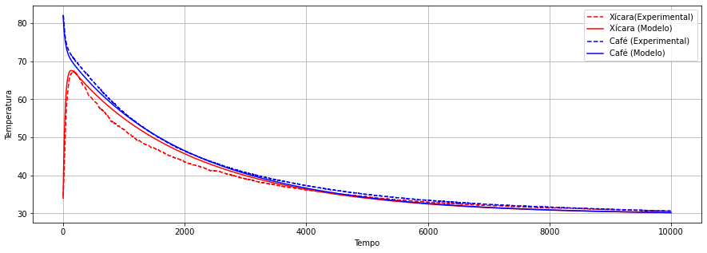
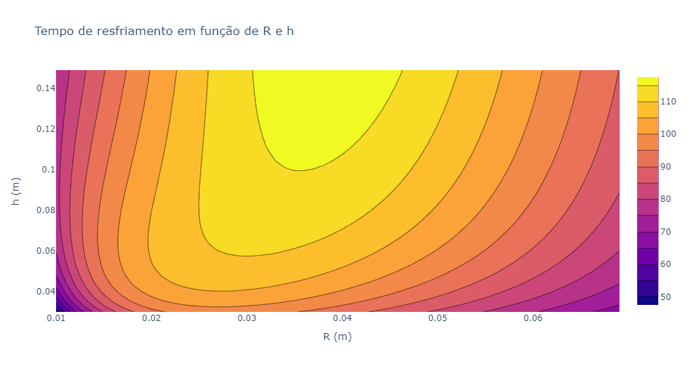

# Em busca da xícara perfeita
Nesse projeto, fizemos a modelagem termodinâmica de uma xícara de café. Nesse cenário, tivemos 3 objetivos:
> 1) Determinar o tempo de resfriamento do café em função da variação da condutividade térmica da xícara e do calor sensível

> 2) Determinar o tempo de resfriamento do café em função da variação da altura h e do raio R da xícara

> 3) Determinar o tempo de resfriamento do café fixando o volume e variando o raio R.

## Validação
Para fazermos a validação, utilizamos um arduino e dois sensores NTC10K para medir a temperatura da xícara e do café, para que no final plotássemos um gráfico de tal forma que fosse possível confrontar nossos dados do modelo com o dados reais (experimentais)
### Gráfico de validação:

## Conclusões
Tendo em vista que o nosso modelo é coerente com a realidade, é possível estabelecer conclusões a respeito dos nossos objetivos.

### Conclusão 1:

> "Determinar o tempo de resfriamento do café em função da variação da condutividade térmica da xícara e do calor sensível"

Acompanhe o gráfico conclusivo em 3 dimensões (O gradiente represente o teceiro eixo, que é o tempo de resfriamento):
